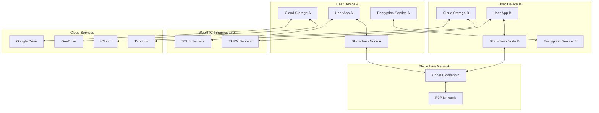
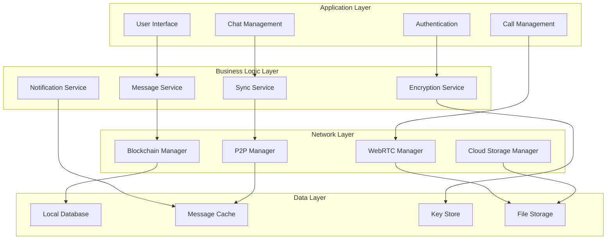

# Design Document

## Overview

Chain is a decentralized messaging platform that combines blockchain technology, peer-to-peer networking, and end-to-end encryption to create a censorship-resistant communication system. The architecture eliminates central servers by using participants' devices as blockchain nodes, with messages transmitted as encrypted transactions that are automatically pruned after delivery.

The system leverages the Signal Protocol for end-to-end encryption, WebRTC for real-time voice/video calls, and integrates with existing cloud storage services for media sharing. This design ensures zero infrastructure costs while maintaining enterprise-grade security and user experience comparable to centralized messaging platforms.

## Architecture

### High-Level System Architecture



### Core Components Architecture



## Components and Interfaces

### 1. Blockchain Manager

**Purpose**: Manages blockchain connectivity, transaction processing, and message distribution.

**Key Interfaces**:
```typescript
interface BlockchainManager {
  connect(nodeUrl: string): Promise<void>
  sendMessage(message: EncryptedMessage): Promise<TransactionHash>
  subscribeToMessages(userId: string): Observable<IncomingMessage>
  getNetworkStatus(): NetworkStatus
  pruneOldMessages(olderThan: Date): Promise<void>
}

interface MessageTransaction {
  id: string
  from: string
  to: string
  encryptedContent: string
  timestamp: number
  signature: string
  nonce: string
}
```

**Implementation Details**:
- Uses WebSocket connections to blockchain nodes
- Implements automatic reconnection with exponential backoff
- Maintains transaction pool for pending messages
- Handles blockchain synchronization and consensus
- Automatically prunes messages after 48-hour delivery window

### 2. Encryption Service (Signal Protocol)

**Purpose**: Provides end-to-end encryption using the Signal Protocol's Double Ratchet algorithm.

**Key Interfaces**:
```typescript
interface EncryptionService {
  initializeSession(recipientId: string, preKeyBundle: PreKeyBundle): Promise<void>
  encryptMessage(plaintext: string, recipientId: string): Promise<EncryptedMessage>
  decryptMessage(ciphertext: EncryptedMessage, senderId: string): Promise<string>
  generatePreKeyBundle(): PreKeyBundle
  rotateKeys(): Promise<void>
}

interface EncryptedMessage {
  content: string
  type: MessageType
  keyId: string
  timestamp: number
}
```

**Implementation Details**:
- Implements Signal Protocol's X3DH key agreement
- Uses Double Ratchet for forward secrecy
- Manages identity keys, signed pre-keys, and one-time pre-keys
- Provides perfect forward secrecy and post-compromise security
- Handles key rotation and verification

### 3. P2P Network Manager

**Purpose**: Manages peer-to-peer connections for direct message delivery and network discovery.

**Key Interfaces**:
```typescript
interface P2PManager {
  discoverPeers(): Promise<Peer[]>
  connectToPeer(peerId: string): Promise<Connection>
  broadcastMessage(message: Message): Promise<void>
  subscribeToNetwork(): Observable<NetworkEvent>
  maintainConnections(): void
}

interface Peer {
  id: string
  address: string
  publicKey: string
  lastSeen: Date
  reliability: number
}
```

**Implementation Details**:
- Uses libp2p for peer discovery and connection management
- Implements DHT (Distributed Hash Table) for peer routing
- Maintains connection pools with reliability scoring
- Handles NAT traversal and firewall penetration
- Provides fallback routing through multiple peers

### 4. WebRTC Manager

**Purpose**: Handles real-time voice and video communication between peers.

**Key Interfaces**:
```typescript
interface WebRTCManager {
  initiateCall(peerId: string, isVideo: boolean): Promise<CallSession>
  acceptCall(callId: string): Promise<CallSession>
  endCall(callId: string): Promise<void>
  toggleMute(): void
  toggleVideo(): void
  switchCamera(): void
}

interface CallSession {
  id: string
  participants: string[]
  isVideo: boolean
  status: CallStatus
  localStream: MediaStream
  remoteStream: MediaStream
}
```

**Implementation Details**:
- Uses WebRTC for peer-to-peer media streaming
- Implements ICE (Interactive Connectivity Establishment)
- Uses STUN/TURN servers for NAT traversal
- Handles codec negotiation and bandwidth adaptation
- Provides call quality monitoring and optimization

### 5. Cloud Storage Manager

**Purpose**: Integrates with cloud storage services for encrypted media sharing.

**Key Interfaces**:
```typescript
interface CloudStorageManager {
  uploadMedia(file: File, cloudService: CloudService): Promise<EncryptedLink>
  downloadMedia(link: EncryptedLink): Promise<File>
  deleteMedia(link: EncryptedLink): Promise<void>
  getStorageQuota(service: CloudService): Promise<StorageInfo>
  authenticateService(service: CloudService): Promise<AuthToken>
}

interface EncryptedLink {
  url: string
  encryptionKey: string
  service: CloudService
  expiresAt: Date
}
```

**Implementation Details**:
- Supports Google Drive, OneDrive, iCloud, and Dropbox APIs
- Encrypts files locally before cloud upload
- Generates time-limited access links
- Implements automatic cleanup of expired files
- Provides storage usage monitoring and optimization

### 6. Local Database Manager

**Purpose**: Manages local message storage, caching, and search functionality.

**Key Interfaces**:
```typescript
interface DatabaseManager {
  storeMessage(message: Message): Promise<void>
  getMessages(chatId: string, limit: number, offset: number): Promise<Message[]>
  searchMessages(query: string): Promise<Message[]>
  deleteMessages(messageIds: string[]): Promise<void>
  syncWithBlockchain(): Promise<void>
}

interface Message {
  id: string
  chatId: string
  senderId: string
  content: string
  type: MessageType
  timestamp: Date
  status: MessageStatus
  replyTo?: string
  reactions: Reaction[]
}
```

**Implementation Details**:
- Uses SQLite with SQLCipher for encrypted local storage
- Implements full-text search with FTS (Full-Text Search)
- Provides message indexing and caching strategies
- Handles data synchronization across devices
- Implements automatic cleanup of old messages

## Data Models

### Core Data Structures

```typescript
// User Identity
interface User {
  id: string
  publicKey: string
  displayName: string
  avatar?: string
  status: UserStatus
  lastSeen: Date
  devices: Device[]
}

// Chat/Conversation
interface Chat {
  id: string
  type: ChatType // DIRECT, GROUP
  name: string
  participants: string[]
  admins: string[]
  settings: ChatSettings
  lastMessage?: Message
  unreadCount: number
  createdAt: Date
  updatedAt: Date
}

// Group-specific data
interface GroupChat extends Chat {
  maxMembers: number
  inviteLink?: string
  permissions: GroupPermissions
  description?: string
}

// Message types
enum MessageType {
  TEXT = 'text',
  IMAGE = 'image',
  VIDEO = 'video',
  AUDIO = 'audio',
  DOCUMENT = 'document',
  LOCATION = 'location',
  CONTACT = 'contact',
  POLL = 'poll',
  SYSTEM = 'system'
}

// Call data
interface Call {
  id: string
  chatId: string
  initiator: string
  participants: string[]
  type: CallType // VOICE, VIDEO
  status: CallStatus
  startTime: Date
  endTime?: Date
  duration?: number
}
```

### Blockchain Data Structures

```typescript
// Blockchain transaction for messages
interface MessageTransaction {
  txHash: string
  from: string
  to: string
  encryptedPayload: string
  messageType: MessageType
  timestamp: number
  blockNumber: number
  gasUsed: number
  signature: string
}

// Block structure
interface Block {
  number: number
  hash: string
  previousHash: string
  timestamp: number
  transactions: MessageTransaction[]
  merkleRoot: string
  nonce: string
  difficulty: number
}
```

## Error Handling

### Error Categories and Strategies

1. **Network Errors**
   - Connection timeouts: Retry with exponential backoff
   - Peer unavailability: Route through alternative peers
   - Blockchain sync failures: Queue messages locally and retry

2. **Encryption Errors**
   - Key exchange failures: Prompt user for manual verification
   - Decryption failures: Request message resend
   - Key rotation issues: Reinitialize session

3. **Storage Errors**
   - Cloud storage failures: Fall back to local storage
   - Database corruption: Rebuild from blockchain history
   - Quota exceeded: Prompt user for cleanup

4. **Call Errors**
   - WebRTC connection failures: Fall back to TURN servers
   - Media device errors: Graceful degradation to audio-only
   - Bandwidth issues: Automatic quality adjustment

### Error Recovery Mechanisms

```typescript
interface ErrorHandler {
  handleNetworkError(error: NetworkError): Promise<void>
  handleEncryptionError(error: EncryptionError): Promise<void>
  handleStorageError(error: StorageError): Promise<void>
  recoverFromFailure(context: ErrorContext): Promise<RecoveryResult>
}

enum RecoveryStrategy {
  RETRY_WITH_BACKOFF,
  FALLBACK_TO_ALTERNATIVE,
  PROMPT_USER_ACTION,
  GRACEFUL_DEGRADATION,
  REINITIALIZE_COMPONENT
}
```

## Testing Strategy

### Unit Testing
- **Encryption Service**: Test Signal Protocol implementation, key generation, and message encryption/decryption
- **Blockchain Manager**: Test transaction creation, signing, and blockchain interaction
- **P2P Manager**: Test peer discovery, connection management, and message routing
- **Database Manager**: Test CRUD operations, search functionality, and data integrity

### Integration Testing
- **End-to-End Message Flow**: Test complete message journey from sender to recipient
- **Cross-Platform Sync**: Test message synchronization across different devices
- **Cloud Storage Integration**: Test file upload/download with all supported services
- **WebRTC Calling**: Test voice/video call establishment and quality

### Performance Testing
- **Message Throughput**: Test system performance with high message volumes
- **Group Chat Scalability**: Test performance with large group sizes (up to 100k members)
- **Blockchain Sync**: Test synchronization performance with network latency
- **Battery Usage**: Test power consumption optimization on mobile devices

### Security Testing
- **Encryption Validation**: Verify Signal Protocol implementation security
- **Key Management**: Test key storage, rotation, and recovery mechanisms
- **Network Security**: Test resistance to man-in-the-middle attacks
- **Data Privacy**: Verify no sensitive data leakage

### Test Automation Framework

```typescript
interface TestSuite {
  unitTests: UnitTest[]
  integrationTests: IntegrationTest[]
  performanceTests: PerformanceTest[]
  securityTests: SecurityTest[]
}

interface TestEnvironment {
  mockBlockchain: MockBlockchainNetwork
  mockCloudStorage: MockCloudServices
  testUsers: TestUser[]
  networkSimulator: NetworkSimulator
}
```

## Security Considerations

### Threat Model
1. **Passive Adversaries**: Cannot decrypt messages due to Signal Protocol encryption
2. **Active Network Attackers**: Cannot modify messages due to blockchain integrity
3. **Compromised Devices**: Limited impact due to forward secrecy and key rotation
4. **Government Censorship**: Resistant due to decentralized architecture

### Security Measures
- **Perfect Forward Secrecy**: Signal Protocol ensures past messages remain secure
- **Post-Compromise Security**: Key rotation limits impact of device compromise
- **Blockchain Integrity**: Cryptographic signatures prevent message tampering
- **Metadata Protection**: Minimal metadata exposure through decentralized routing

### Privacy Features
- **No Phone Numbers**: Authentication through existing accounts or biometrics
- **Disappearing Messages**: Automatic deletion after configurable time periods
- **Anonymous Routing**: P2P network obscures communication patterns
- **Local Data Control**: Users control their own data storage and backups

This design provides a comprehensive foundation for building the Chain messaging platform while ensuring security, scalability, and user experience comparable to centralized alternatives.