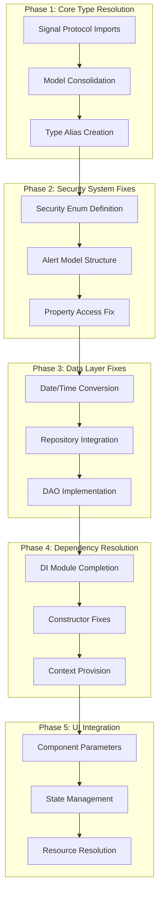
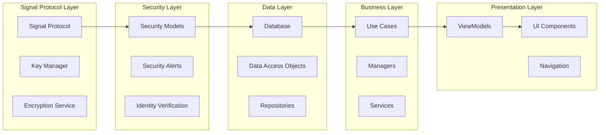

# Design Document

## Overview

The critical system fixes design addresses the fundamental compilation and integration issues preventing the Chain messaging application from building successfully. The approach focuses on systematic resolution of type conflicts, dependency injection problems, and interface mismatches while maintaining the existing architecture and feature completeness.

The design prioritizes minimal disruption to working code while ensuring all components integrate properly. The fixes are organized into logical phases that can be executed incrementally, allowing for validation at each step.

## Architecture

### Fix Implementation Strategy



### Component Integration Flow



## Components and Interfaces

### 1. Signal Protocol Integration Resolver

**Purpose**: Resolves Signal Protocol library integration issues and type conflicts.

**Key Interfaces**:
```kotlin
// Type aliases to resolve conflicts
typealias ChainSenderKeyStore = com.chain.messaging.core.crypto.SenderKeyStore
typealias SignalSenderKeyStore = org.signal.libsignal.protocol.groups.state.SenderKeyStore

// Proper interface implementation
interface SignalProtocolStoreAdapter : SignalProtocolStore {
    fun getChainIdentityStore(): ChainIdentityStorage
    fun getChainSessionStore(): ChainSessionStorage
    fun getChainSenderKeyStore(): ChainSenderKeyStore
}

// Required imports resolution
import org.signal.libsignal.protocol.groups.SenderKeyName
import org.signal.libsignal.protocol.groups.EncryptedGroupMessage
import org.signal.libsignal.protocol.groups.state.SenderKeyRecord
```

**Implementation Strategy**:
- Add proper Signal Protocol library imports
- Create type aliases for conflicting class names
- Implement adapter pattern for store interfaces
- Ensure dependency injection provides correct implementations

### 2. Model Definition Consolidator

**Purpose**: Eliminates duplicate model definitions and establishes single source of truth.

**Key Interfaces**:
```kotlin
// Consolidated Security Models (domain.model package)
sealed class SecurityAlert(
    val id: String,
    val type: SecurityAlertType,
    val severity: SecurityLevel,
    val timestamp: Long,
    val message: String,
    val details: Map<String, Any> = emptyMap()
) {
    data class IdentityKeyChanged(
        val contactId: String,
        val oldKey: String,
        val newKey: String,
        override val timestamp: Long
    ) : SecurityAlert(
        id = UUID.randomUUID().toString(),
        type = SecurityAlertType.IDENTITY_KEY_CHANGED,
        severity = SecurityLevel.HIGH,
        timestamp = timestamp,
        message = "Identity key changed for contact"
    )
    
    data class KeyMismatch(
        val sessionId: String,
        val expectedKey: String,
        val receivedKey: String,
        override val timestamp: Long
    ) : SecurityAlert(
        id = UUID.randomUUID().toString(),
        type = SecurityAlertType.KEY_MISMATCH,
        severity = SecurityLevel.MEDIUM,
        timestamp = timestamp,
        message = "Key mismatch detected"
    )
}

enum class SecurityAlertType {
    IDENTITY_KEY_CHANGED,
    KEY_MISMATCH,
    SUSPICIOUS_ACTIVITY,
    POLICY_VIOLATION
}

enum class SecurityLevel {
    HIGH, MEDIUM, LOW
}

sealed class SecurityRecommendation(
    val id: String,
    val type: SecurityRecommendationType,
    val priority: SecurityLevel,
    val title: String,
    val description: String,
    val actionRequired: Boolean = false
) {
    object VerifyContacts : SecurityRecommendation(
        id = "verify_contacts",
        type = SecurityRecommendationType.VERIFY_CONTACTS,
        priority = SecurityLevel.HIGH,
        title = "Verify Contact Identity",
        description = "Verify the identity of your contacts using safety numbers"
    )
}

enum class SecurityRecommendationType {
    VERIFY_CONTACTS,
    REVIEW_SECURITY_ALERTS,
    UPDATE_KEYS,
    ENABLE_TWO_FACTOR
}
```

**Implementation Strategy**:
- Identify all duplicate model definitions
- Choose domain.model as the authoritative package
- Delete duplicate files and update all imports
- Ensure consistent property access patterns

### 3. Date/Time Conversion Utilities

**Purpose**: Provides consistent date/time handling across the application.

**Key Interfaces**:
```kotlin
object TimeUtils {
    fun dateToLong(date: Date): Long = date.time
    
    fun localDateTimeToLong(dateTime: LocalDateTime): Long = 
        dateTime.toEpochSecond(ZoneOffset.UTC)
    
    fun longToDate(timestamp: Long): Date = Date(timestamp)
    
    fun longToLocalDateTime(timestamp: Long): LocalDateTime = 
        LocalDateTime.ofEpochSecond(timestamp, 0, ZoneOffset.UTC)
    
    fun getCurrentTimestamp(): Long = System.currentTimeMillis()
}

// Extension functions for convenience
fun Date.toLong(): Long = TimeUtils.dateToLong(this)
fun LocalDateTime.toLong(): Long = TimeUtils.localDateTimeToLong(this)
fun Long.toDate(): Date = TimeUtils.longToDate(this)
fun Long.toLocalDateTime(): LocalDateTime = TimeUtils.longToLocalDateTime(this)
```

**Implementation Strategy**:
- Create centralized time conversion utilities
- Replace direct property access with utility methods
- Add extension functions for common conversions
- Update all timestamp handling code consistently

### 4. Dependency Injection Resolver

**Purpose**: Ensures all required dependencies are properly provided and injected.

**Key Interfaces**:
```kotlin
@Module
@InstallIn(SingletonComponent::class)
object CompleteDependencyModule {
    
    @Provides
    @Singleton
    fun provideDisappearingMessageManager(
        messageRepository: MessageRepository,
        notificationService: NotificationService
    ): DisappearingMessageManager = DisappearingMessageManagerImpl(
        messageRepository, notificationService
    )
    
    @Provides
    @Singleton
    fun provideContext(@ApplicationContext context: Context): Context = context
    
    @Provides
    @Singleton
    fun providePeerConnectionFactory(
        @ApplicationContext context: Context
    ): PeerConnectionFactory {
        PeerConnectionFactory.initialize(
            PeerConnectionFactory.InitializationOptions.builder(context)
                .createInitializationOptions()
        )
        return PeerConnectionFactory.builder().createPeerConnectionFactory()
    }
}

// Repository completion
@Singleton
class UserRepositoryImpl @Inject constructor(
    private val userDao: UserDao,
    private val userSettingsDao: UserSettingsDao
) : UserRepository {
    
    override suspend fun getUserById(id: String): User? = 
        userDao.getUserById(id)?.toDomainModel()
    
    override suspend fun getUsersByIds(ids: List<String>): List<User> = 
        userDao.getUsersByIds(ids).map { it.toDomainModel() }
    
    override suspend fun updateUser(user: User): Unit = 
        userDao.updateUser(user.toEntity())
    
    override fun observeUserById(id: String): Flow<User?> = 
        userDao.observeUserById(id).map { it?.toDomainModel() }
    
    override suspend fun insertUser(user: User): Unit = 
        userDao.insertUser(user.toEntity())
}
```

**Implementation Strategy**:
- Complete all missing @Provides methods in DI modules
- Add required constructor parameters to repositories and services
- Ensure Context is available where needed (WebRTC, file operations)
- Implement missing repository methods with proper DAO integration

### 5. UI Component Integration Fixer

**Purpose**: Resolves UI compilation issues and ensures proper component integration.

**Key Interfaces**:
```kotlin
// Smart cast resolution pattern
@Composable
fun CallScreen(
    viewModel: CallViewModel = hiltViewModel()
) {
    val callState by viewModel.callState.collectAsState()
    val localCallState = callState // Local variable for smart cast
    
    when (localCallState) {
        is CallState.Active -> {
            // Smart cast works with local variable
            ActiveCallContent(
                call = localCallState.call,
                onEndCall = viewModel::endCall
            )
        }
        is CallState.Incoming -> {
            IncomingCallContent(
                call = localCallState.call,
                onAccept = viewModel::acceptCall,
                onDecline = viewModel::declineCall
            )
        }
        else -> {
            // Handle other states
        }
    }
}

// StateFlow access pattern
class ChatViewModel @Inject constructor(
    private val messageRepository: MessageRepository
) : ViewModel() {
    
    private val _messages = MutableStateFlow<List<Message>>(emptyList())
    val messages: StateFlow<List<Message>> = _messages.asStateFlow()
    
    fun loadMessages() {
        viewModelScope.launch {
            // Use .value instead of .currentState
            val currentMessages = _messages.value
            // Process messages...
        }
    }
}

// Collection type conversion
fun convertParticipants(participants: Set<String>): List<String> = 
    participants.toList()

// Component parameter completion
@Composable
fun DeviceManagementScreen() {
    LazyColumn {
        items(devices) { device ->
            Chip(
                onClick = { /* handle click */ },
                label = { Text(device.name) },
                modifier = Modifier.padding(4.dp)
            )
        }
    }
}
```

**Implementation Strategy**:
- Use local variables to enable smart cast analysis
- Replace .currentState with .value for StateFlow access
- Add explicit type conversions between collections
- Complete missing component parameters
- Provide fallback icons for missing resources

## Data Models

### Consolidated Security Models

```kotlin
// Single source of truth in domain.model package
data class SecurityEvent(
    val id: String,
    val type: SecurityEventType,
    val severity: SecurityLevel,
    val timestamp: Long,
    val userId: String,
    val details: Map<String, String>,
    val resolved: Boolean = false
)

data class VerificationState(
    val contactId: String,
    val isVerified: Boolean,
    val safetyNumber: String,
    val lastVerified: Long?,
    val verificationMethod: VerificationMethod
)

enum class VerificationMethod {
    QR_CODE, SAFETY_NUMBER, IN_PERSON, NOT_VERIFIED
}
```

### Time Handling Models

```kotlin
// Consistent timestamp handling
data class TimestampedEntity(
    val id: String,
    val createdAt: Long,
    val updatedAt: Long
) {
    fun getCreatedDate(): Date = Date(createdAt)
    fun getUpdatedDate(): Date = Date(updatedAt)
}

// Database entity pattern
@Entity(tableName = "messages")
data class MessageEntity(
    @PrimaryKey val id: String,
    val chatId: String,
    val senderId: String,
    val content: String,
    val timestamp: Long, // Always Long for database consistency
    val type: String,
    val status: String
)
```

## Error Handling

### Compilation Error Resolution Strategy

1. **Unresolved Reference Errors**
   - Systematic import resolution
   - Type alias creation for conflicts
   - Missing method implementation

2. **Type Mismatch Errors**
   - Explicit type conversions
   - Smart cast enablement through local variables
   - Collection type standardization

3. **Dependency Injection Errors**
   - Complete missing @Provides methods
   - Add required constructor parameters
   - Ensure proper scope annotations

4. **UI Compilation Errors**
   - Complete missing component parameters
   - Fix state access patterns
   - Resolve resource references

### Error Recovery Mechanisms

```kotlin
object CompilationErrorResolver {
    
    fun resolveUnresolvedReference(
        className: String,
        packageName: String
    ): ResolutionStrategy {
        return when {
            isSignalProtocolClass(className) -> ResolutionStrategy.ADD_IMPORT
            isDuplicateModel(className) -> ResolutionStrategy.CONSOLIDATE_MODELS
            isMissingImplementation(className) -> ResolutionStrategy.IMPLEMENT_METHOD
            else -> ResolutionStrategy.INVESTIGATE_FURTHER
        }
    }
    
    fun resolveTypeMismatch(
        expectedType: String,
        actualType: String
    ): ConversionStrategy {
        return when (Pair(expectedType, actualType)) {
            Pair("Long", "Date") -> ConversionStrategy.USE_TIME_PROPERTY
            Pair("Long", "LocalDateTime") -> ConversionStrategy.USE_EPOCH_SECONDS
            Pair("List", "Set") -> ConversionStrategy.CALL_TO_LIST
            else -> ConversionStrategy.EXPLICIT_CONVERSION
        }
    }
}
```

## Testing Strategy

### Compilation Validation

1. **Incremental Build Testing**
   - Test compilation after each fix phase
   - Validate no new errors introduced
   - Ensure existing functionality preserved

2. **Integration Testing**
   - Test component interactions after fixes
   - Validate dependency injection works
   - Ensure UI components render correctly

3. **Regression Testing**
   - Verify existing tests still pass
   - Check that fixes don't break working features
   - Validate performance not degraded

### Fix Validation Framework

```kotlin
object FixValidationSuite {
    
    fun validateSignalProtocolIntegration(): ValidationResult {
        return try {
            // Test Signal Protocol imports resolve
            val senderKeyName = SenderKeyName("test", "device")
            val encryptedMessage = EncryptedGroupMessage(byteArrayOf())
            ValidationResult.SUCCESS
        } catch (e: Exception) {
            ValidationResult.FAILURE(e.message)
        }
    }
    
    fun validateModelConsolidation(): ValidationResult {
        return try {
            // Test no duplicate model conflicts
            val alert = SecurityAlert.IdentityKeyChanged("test", "old", "new", System.currentTimeMillis())
            val recommendation = SecurityRecommendation.VerifyContacts
            ValidationResult.SUCCESS
        } catch (e: Exception) {
            ValidationResult.FAILURE(e.message)
        }
    }
    
    fun validateDependencyInjection(): ValidationResult {
        // Test all DI modules provide required dependencies
        // Validate no missing dependencies at runtime
        return ValidationResult.SUCCESS
    }
}
```

This design provides a systematic approach to resolving all critical compilation and integration issues while maintaining the existing architecture and ensuring the Chain messaging application can build and run successfully.